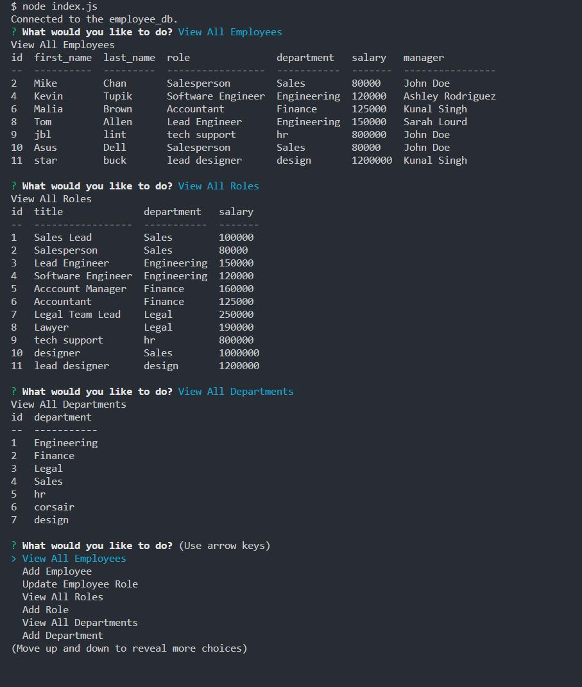

# 12-SQL-Employee-Tracker

## Description

    It is a simple team profile generator using command prompt. 

    Enter your team's information and this generator will generate a HTML page 
    for your team members.      

## Table of Contents (Optional)

- [Installation](#installation)
- [Usage](#usage)
- [License](#license)
- [Contributing](#contributing)
- [Tests](#tests)
- [Questions](#questions)

## Installation

To install necessary dependencies, run the following command: 

    npm i  

## Usage

Step1: run following command in your terminal:
    node index.js 

step 2: type in your information to the prompt
    example:

#
    The team profile

#
    HTML structure

## License

N/A

## How to Contribute

N/A

## Tests

To run jest tests, run the following command: 
    
    npm run test